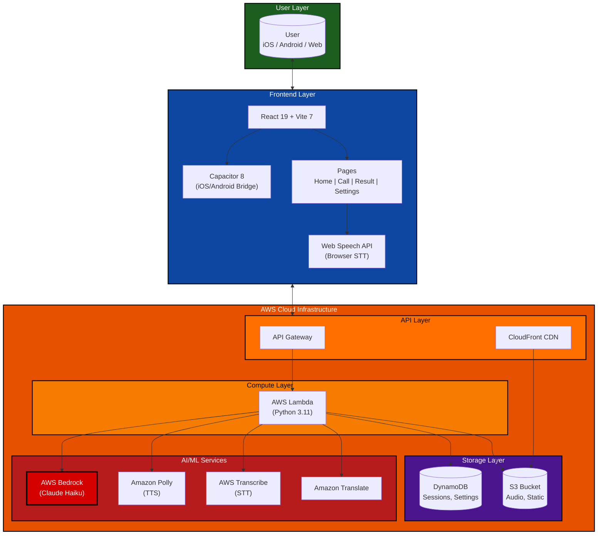
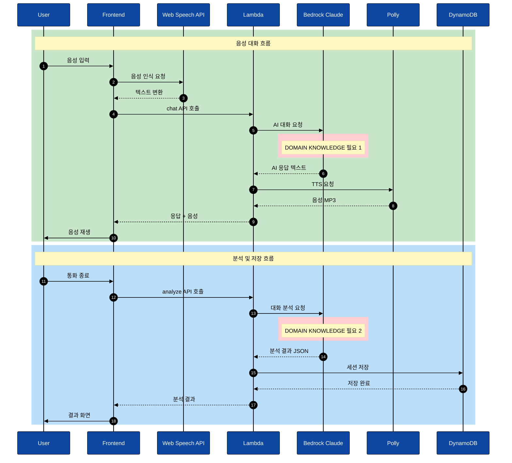
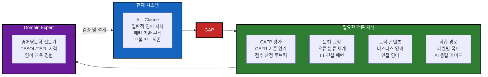
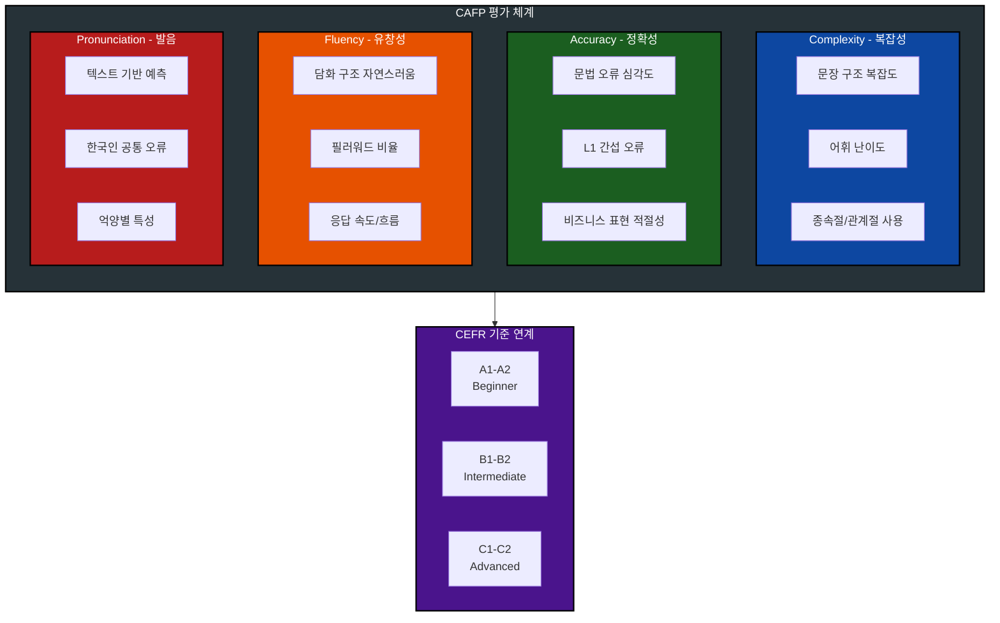
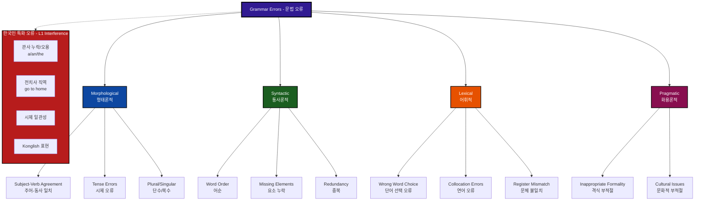
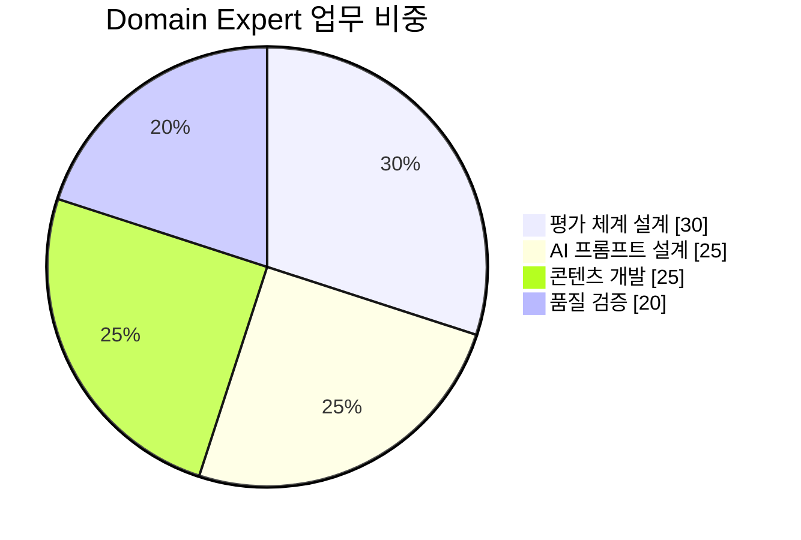
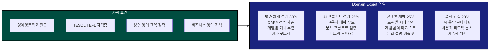

# Ringle AI - 기술 다이어그램

## 1. 기술 구성도 (System Architecture)

---

## 2. 기술 작동 흐름도 (Sequence Diagram)

### Domain Knowledge 필요 지점 상세

| 지점 | 필요 내용 |
|------|-----------|
| **DOMAIN KNOWLEDGE 필요 1** | 레벨별 적절한 응답 생성, 비즈니스/일상 영어 전문성 |
| **DOMAIN KNOWLEDGE 필요 2** | CAFP 점수 평가 기준, 문법 오류 분류 체계, 레벨별 피드백 설계 |

---

## 3. Domain Knowledge 필요 영역

> **핵심 문제:** AI 프롬프트만으로는 교육학적으로 검증된 품질을 보장하기 어려움.
> 영어 영문학 전문가가 평가 기준 설계, 프롬프트 검증, 콘텐츠 개발, 품질 모니터링을 담당해야 함.

---

## 4. CAFP 평가 시스템 상세

---

## 5. 문법 오류 분류 체계 (Error Taxonomy)

---

## 6. Domain Expert 역할 및 업무 분담

---

## 7. 기술 스택 요약

| 계층 | 기술 | 용도 |
|------|------|------|
| **Frontend** | React 19 + Vite 7 | UI 프레임워크 |
| | Capacitor 8 | iOS/Android 네이티브 브릿지 |
| | Web Speech API | 브라우저 음성 인식 |
| **Backend** | AWS Lambda (Python 3.11) | 서버리스 함수 |
| | API Gateway | REST API 엔드포인트 |
| **AI/ML** | AWS Bedrock (Claude Haiku) | 대화 생성 + 분석 |
| | Amazon Polly | TTS (음성 합성) |
| | AWS Transcribe | STT (음성 인식) |
| | Amazon Translate | 영한 번역 |
| **Storage** | DynamoDB | 사용자 데이터, 세션 기록 |
| | S3 | 오디오 파일, 정적 리소스 |
| **Hosting** | CloudFront + S3 | 웹 배포 |
